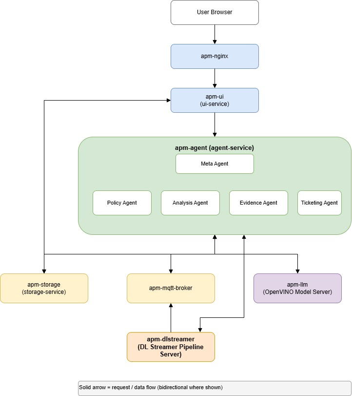

# Agentic Predictive Maintenance Blueprint

A config-driven, multi-agent blueprint for industrial defect detection on Intel edge hardware.
Built for [edge-ai-libraries](https://github.com/intel/edge-ai-libraries), deployable to new
use cases without code changes.

## Architecture



**3 new microservices** + **4 reused** from `edge-ai-libraries/microservices/`:

| Service                  | Type    | Port |
|--------------------------|---------|------|
| `apm-storage`            | New     | 5001 |
| `apm-agent`              | New     | 5002 |
| `apm-ui`                 | New     | 5003 |
| `dlstreamer-pipeline-server` | Reused | 8554 |
| `openvino/model_server`  | Reused  | 8010 |
| `model-download`         | Reused  | 8200 |
| `metrics-manager`        | Reused  | 9091 |

## Quick Start

### Prerequisites

- Docker ≥ 24.0 and Docker Compose ≥ 2.20
- Intel CPU/GPU/NPU (tested on 4th Gen Xeon and Arc GPU)
- 16 GB RAM minimum; 32 GB recommended for LLM mode
- Python 3.10+ and `opencv-python` (for data prep script only)

### 1. Clone and configure

```bash
git clone https://github.com/intel/edge-ai-libraries
cd edge-ai-libraries/sample-applications/agentic-predictive-maintenance

# Review and edit the use-case env file
vi apps/pipeline-defect-detection/.env_pipeline-defect-detection
```

### 2. Prepare sample data (required for DL Streamer inference)

The DL Streamer pipeline needs a sample video to run. Use the provided script
to download the Kaggle pipeline-defect dataset and build the video automatically:

```bash
pip install opencv-python

python scripts/download_and_prep_data.py \
    "https://www.kaggle.com/api/v1/datasets/download/simplexitypipeline/pipeline-defect-dataset" \
    --use-case pipeline-defect-detection
```

This will:
- Download and extract the dataset (~300 MB)
- Split into 90% train / 10% val (YOLO format in `datasets/pipeline_defect_detection/`)
- Build `apps/pipeline-defect-detection/resources/videos/sample.mp4` for DL Streamer

> **DISCLAIMER**: By running this script you acknowledge that you are solely
> responsible for the rights, permissions, and licenses to use the dataset at
> the provided URL.

> **Skip this step** if you already have a video or want to run in
> `LLM_MODE=fallback` (rule-based, no DL Streamer inference required).

### 3. Download the LLM model (LLM mode only)

`setup.sh` mounts a local, OVMS-formatted LLM into the `apm-llm` service — it does not
download or convert the model itself. Fetch and convert the model configured in the env
file (`LLM_MODEL_NAME`/`LLM_DEVICE`/`LLM_WEIGHT_FORMAT`) using the model-download
microservice already defined in `docker/compose.base.yaml`:

```bash
./scripts/download_llm_model.sh --use-case pipeline-defect-detection
```

This writes the resulting local model path back into the use-case env file as
`LLM_MODEL_PATH`. Skip this step if running in `LLM_MODE=fallback`.

### 4. Launch (LLM mode)

```bash
./setup.sh --use-case pipeline-defect-detection
```

### 5. Launch (fallback / rule-based mode — no GPU or video required)

```bash
LLM_MODE=fallback ./setup.sh --use-case pipeline-defect-detection
```

### 6. Open the dashboard

```
http://localhost:8080
```

### 7. Stop and clean up

```bash
./setup.sh --stop
./setup.sh --clean-data   # also removes SQLite data
```

## Configuration Reference

All use-case behaviour is controlled by 4 files in `apps/<use-case>/`:

| File | Purpose |
|------|---------|
| `configs/agents.yaml` | Agent pipeline settings, defect classes, thresholds |
| `configs/pipeline-server-config.json` | DL Streamer pipeline and model paths |
| `configs/policy_fallback.json` | Rule-based fallback thresholds and actions |
| `prompts/<use-case>.txt` | LLM prompt sections: SYSTEM, POLICY, ANALYSIS, EVIDENCE, TICKETING |

### agents.yaml keys

```yaml
use_case_id: pipeline-defect-detection   # must match prompt file name
analysis:
  min_confidence: 0.5                    # detections below this are filtered
policy:
  defect_classes: [Rupture, ...]         # labels emitted by DL Streamer
  alert_threshold: 0.7                   # confidence threshold for violations
  critical_classes: [Rupture, Disconnect]
```

### Prompt file sections

Sections are delimited by `[SECTION_NAME]` headers:

```
[SYSTEM]   — system role for all agents
[POLICY]   — policy agent instructions
[ANALYSIS] — analysis agent instructions
[EVIDENCE] — evidence agent instructions
[TICKETING]— ticketing agent instructions (optional; falls back to ANALYSIS)
```

## Creating a New Use Case

To adapt the blueprint to, e.g., **weld defect detection**:

```bash
# In edge-ai-suites repo:
cp -r manufacturing-ai-suite/agentic-predictive-maintenance/apps/pipeline-defect-detection \
      manufacturing-ai-suite/agentic-predictive-maintenance/apps/weld-defect-detection

# Edit the 4 config files — no code changes needed
vi apps/weld-defect-detection/configs/agents.yaml          # change use_case_id, classes
vi apps/weld-defect-detection/configs/policy_fallback.json # set thresholds
vi apps/weld-defect-detection/prompts/weld-defect-detection.txt
echo "weld-defect-detection/FP16/weld-model.xml" > apps/weld-defect-detection/models/model_list.txt

# Launch
./setup.sh --use-case weld-defect-detection \
  --use-case-dir ../edge-ai-suites/manufacturing-ai-suite/agentic-predictive-maintenance/apps/weld-defect-detection
```

## API Reference

### Storage Service (`http://localhost:8080/api/storage/`)

| Method | Path | Description |
|--------|------|-------------|
| POST | `/detections` | Insert single detection |
| POST | `/detections/batch` | Bulk insert detections |
| GET | `/detections` | Query detections (filter: `label`, `min_confidence`, `limit`) |
| GET | `/detections/summary` | Per-class statistics |
| DELETE | `/detections` | Clear all detections |
| GET | `/health` | Health check |
| GET | `/metrics` | Prometheus metrics |

### Agent Service (`http://localhost:8080/api/agents/`)

| Method | Path | Description |
|--------|------|-------------|
| POST | `/agents/run` | Trigger one detect-then-reason cycle: starts the DL Streamer pipeline, waits for it to finish processing the source video, then runs the agent pipeline over exactly the detections it produced (async; 202). Returns 409 if a run is already in progress |
| GET | `/agents/status/{run_id}` | Check run status and current phase (`detecting`/`reasoning`/`completed`/`error`) |
| GET | `/agents/results/{run_id}` | Get run results |
| GET | `/agents/runs` | List all runs |
| GET | `/health` | Health check |
| GET | `/metrics` | Prometheus metrics |

## Environment Variables

| Variable | Default | Description |
|----------|---------|-------------|
| `LLM_MODE` | `llm` | `llm` or `fallback` (rule-based) |
| `LLM_MODEL_NAME` | `microsoft/Phi-3.5-vision-instruct` | Model served by OVMS |
| `LLM_DEVICE` | `CPU` | Inference device: CPU, GPU, NPU |
| `LLM_WEIGHT_FORMAT` | `int4` | Quantization: fp32, fp16, int8, int4 |
| `DLSTREAMER_RUN_TIMEOUT` | `600` | Max seconds to wait for the DL Streamer pipeline to finish one run before the agent-service reports a failure |
| `MQTT_TOPIC` | `dlstreamer/detections` | MQTT topic for detection events |


## Development

### Run tests

```bash
# All services
make test

# Individual service
make test-storage
make test-agents
make test-ui
```

### Build images

```bash
make build              # all 3 new services
make build-storage      # storage-service only
make build-agents       # agent-service only
make build-ui           # ui-service only
```

### Lint

```bash
make lint
```

## Telemetry

Prometheus metrics are available at:

- Storage service: `http://localhost:9091/metrics` (`apm_storage_detections_total`)
- Agent service: `http://localhost:9091/metrics` (`apm_agent_runs_total`, `apm_agent_runs_completed`)
- Prometheus UI: `http://localhost:9090`
