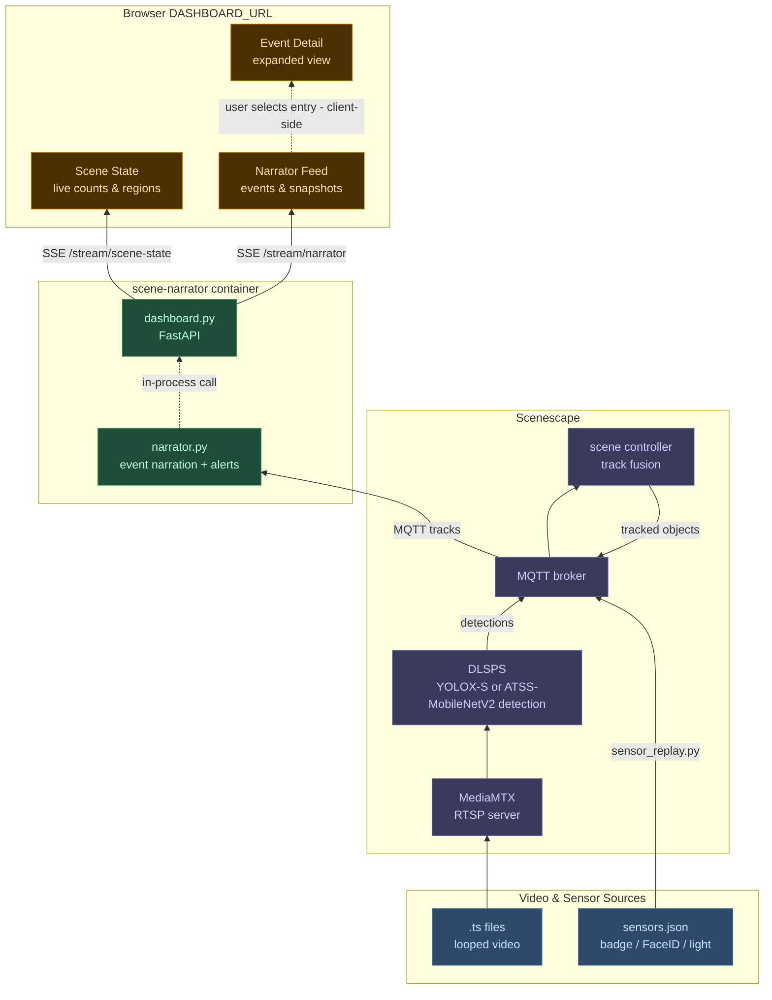

# Smart Building Digital Twin

Smart Building Digital Twin sample application is a complete smart-building monitoring simulation that includes the end-to-end deployment: inputs, processing, analytics, dashboard, configuration, and startup scripts.

The sample application uses synchronized cameras, YOLOX-S and ATSS-MobileNetV2 model variants, and sensors to watch a building for:

- People, luggage, and doors
- Replayed sensor events of badge, FaceID, and ambient-light changes
- Possible falls and luggage-related events
- Abandoned, stolen, or exchanged luggage
- Door states and region occupancy
- System telemetry, including CPU, GPU, memory, storage, and CPU SKU

The system runs with Docker Engine and Docker Compose tool, and Scenescape. Camera videos and sensor data are replayed in synchronization. Camera detections, tracking data, and sensor events are exchanged through the Message Queuing Telemetry Transport (MQTT) protocol and analyzed by Python programs.

An AI analytics web dashboard shows simulated building activity, alerts, camera snapshots, and system health. The setup.sh script downloads required images and plugins, configures the deployment, and starts the services, while configuration files control the cameras, YOLOX-S and ATSS-MobileNetV2 model variants, scenes, and tracking behavior.

## Overview

- Seven-camera scene with looping RTSP video streams
- ATSS-MobileNetV2 detection model in INT8 (default for both GPU and CPU; override `MODEL_NAME` to `smartbuilding-fp16` if needed that uses YOLOX-S detection model)
- Badge and FaceID sensor replay synchronized to video loops via raw camera metadata
- Ambient-light sensor values change to reflect dark and live states as the camera video loops.
- Analytics dashboard at the configured `DASHBOARD_URL` with live scene narration

## Architecture



**narrator.py** subscribes to MQTT track data and produces a rolling 10-minute text window of scene events. It detects the following alert and warning types:

| Alert | Description |
|---|---|
| No credentials at `Checkpoint` | Person enters an inbound zone without a badge or FaceID |
| Badge switch | An inbound `Checkpoint` or `Entry` crossing shows a badge associated with a different face than the face previously associated with the badge during the loop |
| Possible badge switch | An outbound `Checkpoint` or `Entry` crossing shows a badge associated with a different face than the face previously associated with the badge during the loop |
| Possible fall | Person in a horizontal posture outside a furniture region |
| Luggage abandoned | Owner walks ≥ 4 m away from their luggage while still moving — fires immediately, captures snapshots of both person and bag |
| Unattended luggage | Luggage has had no companion for more than 30 seconds — covers cases where the owner has left the scene entirely |
| Luggage stolen | A single bag's companion changes to a different person; the dashboard captures both handoff-time and alert-time images for evidence |
| Luggage switch | Two bags swap companions coordinately (bag A: person 1 → person 2, bag B: person 2 → person 1) |

**dashboard.py**, a web UI created and served by the FastAPI framework, exposes two Server-Sent Events (SSE) endpoints: `/stream/narrator` for rolling scene events and `/stream/scene-state` for live object counts, door states, and region occupancy.

## Prerequisites

- Docker Engine and Docker Compose tool
- Python 3 programming language, OpenSSL toolkit, jq tool
- Intel® GPU recommended; CPU fallback supported
- For Panther Lake `xe` GPU telemetry, install `xpu-smi` on the host before running `./setup.sh`
- Host install example on Ubuntu OS version 24.04 when the Intel graphics repository or PPA is already configured: `sudo apt install xpu-smi`
- If the GPU name still appears as a raw Peripheral Component Interconnect (PCI) ID after host package install, refresh the host PCI ID database with `sudo update-pciids`
- Install the Git Large File Storage (LFS) extension **before** cloning, for video file storage:
  ```bash
  # Ubuntu/Debian
  sudo apt install git-lfs
  git lfs install
  ```

## Scenescape Images

Scenescape images are pulled automatically from Docker Hub by `./setup.sh` — no manual build step required. The images used are:

| Image | Tag |
|---|---|
| `intel/scenescape-manager` | `2026.2.0` |
| `intel/scenescape-controller` | `2026.2.0` |
| `intel/scenescape-autocalibration` | `2026.2.0` |
| `intel/scenescape-analytics` | `2026.2.0` |
| `intel/dlstreamer-pipeline-server` | `2026.2.0-ubuntu24` |

`setup.sh` automatically downloads the GStreamer plugin scripts (`gstplugins/`) used by the Deep Learning Streamer (DL Streamer), from the Scenescape repository using a sparse shallow clone. Only the `gstplugins/` directory is downloaded; a full repository clone and local image build are not required.

## Setup

Clone the repository (Git LFS extension is required for video and model files), then run:

```bash
./setup.sh
```

The script prompts for an admin password (`SUPASS`) and a database password (`DATABASE_PASSWORD`), generates TLS certificates, starts all services, waits for the API, imports the included Showcase scene automatically, and then performs a best-effort telemetry check.

If `xpu-smi` is already installed on the host, `./setup.sh` also grants the needed host access for `xpu-smi`, starts the host GPU telemetry bridge, and verifies that the analytics service can read telemetry. If you install `xpu-smi` after the initial deployment, rerun `./setup.sh`.

The analytics service learns the `SideDoorEntry` door-state baseline only after the first complete replay loop, preventing partial data from a mid-loop startup from affecting the baseline.

After setup:
- Scenescape web UI: `SCENESCAPE_UI_URL` from `.env` (accept the self-signed certificate)
- Analytics dashboard: `DASHBOARD_URL` from `.env`

## Project Structure

```
config/          Model files, and pipeline and tracker configuration
datasets/        Looping video files per scene (Git LFS)
scenes/          Scene zip bundles and sensor event data
scripts/
  narrator.py        Converts MQTT tracks to rolling scene narrative and alerts
  dashboard.py       FastAPI server — SSE streams and web UI
  sensor_replay.py   Replays sensor events (badge, FaceID, and ambient light) in synchronization with video loops
  export-config.sh   Exports object class definitions and scene configurations from the live API
  restore-assets.sh  Restores object class definitions to a fresh Scenescape instance
  static/
    index.html       Three-column analytics dashboard (scene state | narrator feed | event detail)
config/
  object-classes.json   Backed-up object class definitions (person, luggage, and door)
  scenes/               Scene configuration snapshots exported from the API
docker-compose.yml
setup.sh
```

## Analytics Dashboard

Get the analytics dashboard URL from the `.env` file and enter the URL in a browser. The dashboard opens with three columns:

- **Scene State** (left) — live counts of people, bags, doors, and region occupancy updated each tick. The state persists across page reloads via the `localStorage` API.
- **System Telemetry** (left, below Region Occupancy) — CPU SKU plus current CPU, GPU, memory, and storage usage sampled with each dashboard snapshot.
- **Scene Narrator** (center) — a rolling 10-minute feed of scene events and camera snapshots, updated every 10 seconds. You can configure the update interval via `SNAPSHOT_INTERVAL` in the `.env` file. Security alerts are highlighted in red. Feed persists across page reloads via the `localStorage` API.
- **Event Detail** (right) — expanded view of the selected narrator entry.

For `luggage stolen` events, the detail view shows `handoff ...` images before `alert ...` images so the evidence appears in chronological order.

## Telemetry

- The analytics container samples CPU, memory, storage, and CPU SKU directly.
- For Panther Lake `xe` GPU telemetry, `./setup.sh` expects host `xpu-smi` to already be installed. It then configures host access, starts the bridge, and keeps writing fresh GPU utilization snapshots to `generated/telemetry/xpu-smi.json`.
- `./setup.sh` is intended to be run interactively when host permissions must be adjusted for `xpu-smi`. In non-interactive mode, the script warns instead of prompting for `sudo`.
- `./cleanup.sh` stops the host telemetry bridge as part of teardown.
- The analytics container reads the bridge JSON from `generated/telemetry/xpu-smi.json` and also has direct fallbacks for CPU, memory, storage, and Intel GPU probes.
- After setup, you can inspect the current host GPU telemetry bridge output in `generated/telemetry/xpu-smi.json`.

## Configuration

Key variables in the `.env` file:

| Variable | Default | Description |
|---|---|---|
| `PUBLIC_HOSTNAME` | Detected from the `hostname` | The hostname used to build the default web and API URLs, and TLS certificate Subject Alternative Names (SANs) |
| `API_BASE_URL` | `https://localhost/api/v1` | Host-local Scenescape API base URL used by the setup and helper scripts; override this when running the helper scripts from another machine |
| `SCENESCAPE_UI_URL` | `https://$PUBLIC_HOSTNAME` | Scenescape web UI URL printed by the setup |
| `DASHBOARD_URL` | `http://$PUBLIC_HOSTNAME:$DASHBOARD_PORT` | Browser URL for the analytics dashboard |
| `SNAPSHOT_INTERVAL` | `10` | Seconds between narrator snapshots |
| `DASHBOARD_PORT` | `7000` | Host port for the analytics dashboard |
| `SCENESCAPE_IMAGE_TAG` | `2026.2.0` | Scenescape image tag pulled from Docker Hub |
| `MODEL_NAME` | `smartbuilding-int8` | Detection model variant; set to `smartbuilding-fp16` for FP16 |

## Adding a New Scene

1. Add `scenes/{SceneName}.zip` and `datasets/{scene-name}/cam-*.ts`
2. (Optional) Add `scenes/{SceneName}-sensors.json` for sensor replay. If present, the project’s sensor replay process can replay those events in synchronization with the scene’s looping camera videos. 
3. Run `./setup.sh`

## Exporting Configuration

After making changes in the Scenescape UI, for example, editing object classes, adjusting camera transforms, and updating regions, run the export script to capture the new state:

```bash
PASSWORD=<admin-password> ./scripts/export-config.sh
```

This writes:
- `config/object-classes.json` — current object class definitions, i.e. person, luggage, and door.
- `config/scenes/{Name}.json` — full scene configuration, e.g. cameras, intrinsics, transforms, and regions.

Commit the updated files to keep the repository in synchronization with the live instance.

## Troubleshooting

- **Scene import fails with `No JSON found in scenes/*.zip`** — Git LFS was not installed, or `git lfs pull` did not run, so the scene bundle is still a small LFS pointer file instead of the real binary.

  Confirm it, then fix it:
  ```bash
  $ file scenes/Showcase.zip
  scenes/Showcase.zip: ASCII text          # should be "Zip archive data", not text

  $ head -c 60 scenes/Showcase.zip
  version https://git-lfs.github.com/spec/v1              # confirms it's an LFS pointer

  $ sudo apt install git-lfs
  $ git lfs install
  $ git lfs pull
  $ file scenes/Showcase.zip
  scenes/Showcase.zip: Zip archive data, at least v2.0 to extract   # fixed
  ```
  Re-run `./setup.sh` afterward.

- **`setup.sh` succeeds but `SCENESCAPE_UI_URL` or `DASHBOARD_URL` is unreachable from the browser** — this is almost always host DNS/proxy configuration rather than a service problem. First confirm the stack is healthy and reachable locally:
  ```bash
  docker compose ps
  curl -k https://localhost/api/v1/database-ready
  ```
  If those succeed but `$PUBLIC_HOSTNAME` does not, walk through both checks below. (`my-host.example.com` below stands in for your own `$PUBLIC_HOSTNAME`, and `10.1.2.50` stands in for this machine's own IP — substitute your actual values.)

  **Check 1 — stale DNS.** `getent hosts $PUBLIC_HOSTNAME` should resolve to this machine's own IP (compare with `hostname -I`):
  ```bash
  $ getent hosts my-host.example.com
  10.1.2.200      my-host.example.com        # wrong — not this machine's IP

  $ hostname -I
  10.1.2.50 172.17.0.1 ...                   # this machine is actually 10.1.2.50
  ```
  Fix by adding a corrected entry to `/etc/hosts` (needs sudo):
  ```bash
  echo "10.1.2.50 my-host.example.com" | sudo tee -a /etc/hosts
  ```

  **Check 2 — proxy swallowing the hostname.** With `HTTP_PROXY`/`HTTPS_PROXY` set, requests to `$PUBLIC_HOSTNAME` can still be routed through the corporate proxy and time out (HTTP 504), even after DNS is fixed, because `no_proxy` only lists the raw IP and not the hostname/domain:
  ```bash
  $ curl -sk -o /dev/null -w "%{http_code}\n" https://my-host.example.com/api/v1/database-ready
  504                                                       # proxy can't reach the private IP

  $ curl -sk --noproxy '*' -o /dev/null -w "%{http_code}\n" https://my-host.example.com/api/v1/database-ready
  200                                                       # works once the proxy is bypassed — confirms the proxy is the cause
  ```
  Add the internal domain to `no_proxy`/`NO_PROXY` (e.g. ` .example.com`), and check that nothing later in `~/.bashrc` or other shell startup files re-exports `no_proxy`/`NO_PROXY` without it — a later `export no_proxy=...` silently overwrites rather than appends to an earlier one. Restart the browser afterward so it picks up the change.

## Copilot Workspace Files

This repository includes shared Copilot customization files to help with cross-system tuning and deployment debugging:

- `.github/copilot-instructions.md` — always-on project guidance for preserving the Scenescape networking model, localhost setup behavior, and tuning workflow
- `.github/skills/tune-other-systems/SKILL.md` — on-demand skill for investigating why another machine behaves differently from the reference system
- `.github/skills/tune-other-systems/assets/system-delta-template.md` — checklist for capturing machine, environment, service, and scene differences before making changes

Use the tuning skill before changing analytics logic on another system. In most cases, the important first comparisons are `.env`, GPU and CPU mode, service health, `config/resolved-uuids.json`, and exported scene and object-class configuration.

## Useful Commands

```bash
docker compose up -d                    # start all services
docker compose down                     # stop all services
docker compose ps                       # check service status
docker compose logs -f analytics        # stream analytics logs
docker compose logs -f scene-narrator   # stream dashboard and narrator logs
./cleanup.sh                            # stop services and remove all generated files and volumes
```

## Notice for FFmpeg:

FFmpeg is an open source project licensed under LGPL and GPL. See https://www.ffmpeg.org/legal.html. You are solely responsible for determining if your use of FFmpeg requires any additional licenses. Intel is not responsible for obtaining any such licenses, nor liable for any licensing fees due, in connection with your use of FFmpeg.
