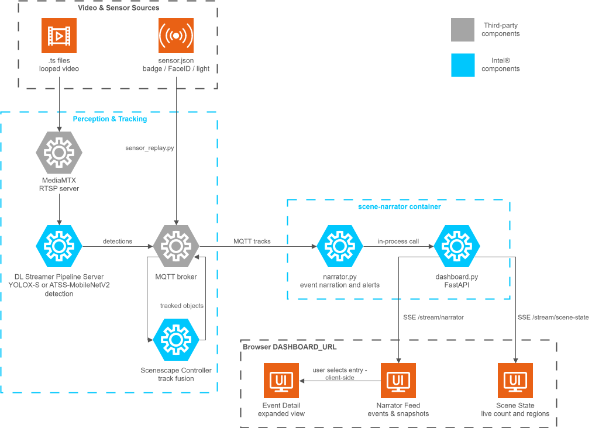

# How It Works

The sample application provides:

- A seven-camera scene with looping RTSP video streams
- ATSS-MobileNetV2 detection model in INT8 (default for both GPU and CPU; override
  `MODEL_NAME` to `smartbuilding-fp16` if needed that uses YOLOX-S detection model)
- Badge and FaceID sensor replay synchronized to video loops via raw camera metadata
- Ambient-light sensor values change to reflect dark and live states as the camera
  video loops.
- Analytics dashboard at the configured `DASHBOARD_URL` with live scene narration
- Setup automation through `./setup.sh`

## High-Level Architecture

The sample application has the following architecture elements:

- Video and sensor sources
- Scenescape components for MediaMTX media router, the DL Streamer Pipeline Server (DLSPS),
  scene controller, and MQTT broker
- A scene-narrator container that runs narrator and dashboard services
- A browser dashboard that shows scene state, narrator feed, and event detail

