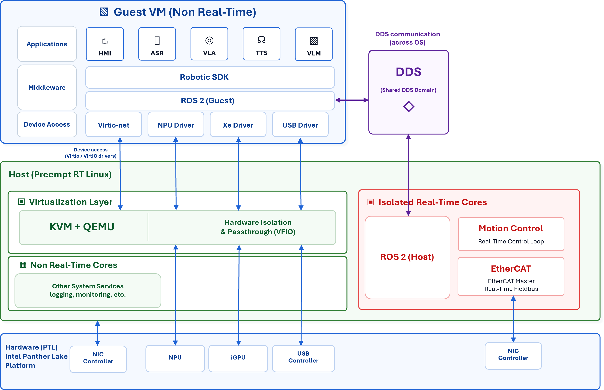

# KVM Hypervisor (Optional)
This document demonstrates the steps for setting up an environment that implements the Robotics KVM virtualization solution. The examples below are provided in both QEMU command-line format and libvirt XML parameter format.
> **Note:** The parameter values in the examples below are not fixed. Please modify them based on your hardware resources, firmware/image paths, and business requirements.

## Scenario

The following diagram shows the overall architecture of the Robotics KVM solution on Intel Core Ultra Series 3 (code name PTL), organized into three layers: the PTL hardware, the Host OS, and the Guest OS. Each of the hardware and Host OS layers is further partitioned into a real-time (RT) domain and a non-real-time (non-RT) domain.



- **(Hardware, PTL platform)** — Using PTL X7 358H as an example: dedicated to the RT domain (4x LPE cores + a NIC), shared by the non-RT domain and Guest OS (4x P cores, 8x E cores, NIC, USB, and NVMe), and passed through to the Guest OS (iGPU, NPU, USB controller)
- **(Host OS)** — Ubuntu 24.04 with a 6.17 RT kernel. Its RT domain maps to the L1 RT hardware and runs motion control, using the RT NIC to drive external motors over EtherCAT. Its non-RT domain maps to the L1 non-RT hardware and provides KVM + QEMU virtualization services.
- **(Guest OS)** — Ubuntu 24.04 with a 6.17 kernel. It receives the iGPU, NPU, and USB controller via KVM passthrough from the Host, and shares net and NVMe with the Host through virtio.

## Basic Environment Setup

### Install Ubuntu 24.04 as the host OS

1. Install and set up Ubuntu 24.04 on the main storage.
Follow the steps to set up the OS and APT repository: [OS Setup](../../platform_foundation/getting_started/express.md).

2. Set up real-time Linux.
Follow the steps to set up real-time Linux: [RT Linux](../realtime_determinism/realtime_linux.md). Follow the steps to complete real-time tuning: [RT Tuning](../realtime_determinism/rt_tuning_guide.md).

3. Install host packages for the KVM/QEMU system.
```bash
sudo apt update
sudo apt install qemu-system-x86 qemu-utils ovmf bridge-utils pciutils \
        libvirt-daemon libvirt-daemon-driver-qemu libvirt-daemon-system libvirt-clients
```

4. Set up virtualization related setting.
Make sure `Intel (VMX) Virtualization` and `VT-d` are enabled in BIOS setting.
Huge pages are also needed to boot the Guest OS. Edit boot parameters in host environment, add:
```bash
default_hugepagesz=1G hugepages=[size allocated for Guest OS in GB] hugepagesz=1G
```

### Build the Guest OS image

1. Build a QEMU qcow2 image that runs Ubuntu 24.04 OS.
Refer to [Build Image](./image_build.md).

2. Set up the OS and install packages for the VM.
Follow the steps to set up the OS and APT repository: [OS Setup](../../platform_foundation/getting_started/express.md).

### Build the OVMF and iGPU ROM file

Refer to [Build OVMF for KVM](https://eci.intel.com/docs/3.3/components/kvm-hypervisor.html#build-ovmf-fd-for-kvm) to build a specific OVMF image and an iGPU ROM file.

## KVM Example Parameters

The following sections provide examples for configuring device parameters using either direct QEMU parameters or libvirt XML parameters.

### CPU

<!--hide_directive::::{tab-set}hide_directive-->
<!--hide_directive:::{tab-item}hide_directive--> **QEMU**

```bash
-cpu host -smp cores=12,threads=1,sockets=1
```

<!--hide_directive:::hide_directive-->
<!--hide_directive:::{tab-item}hide_directive--> **Libvirt**

```xml
<vcpu placement='static'>12</vcpu>
<cpu mode='host-passthrough' check='none'>
  <topology sockets='1' cores='12' threads='1'/>
</cpu>
```

<!--hide_directive:::hide_directive-->
<!--hide_directive::::hide_directive-->

### CPU Affinity

<!--hide_directive::::{tab-set}hide_directive-->
<!--hide_directive:::{tab-item}hide_directive--> **QEMU**

Add the following QEMU parameter:

```bash
-name ubuntu-vm,debug-threads=on
```

Launch the guest OS, then get vCPU thread IDs by running:

```bash
ps -L -o comm,pid,lwp,psr -p $(pgrep qemu) | grep CPU
```

Then use `taskset` to pin CPUs. For example:

```bash
taskset -pc "$pcpu" "$lwp"
```

<!--hide_directive:::hide_directive-->
<!--hide_directive:::{tab-item}hide_directive--> **Libvirt**

```xml
<cputune>
  <vcpupin vcpu='0' cpuset='0'/>
  <vcpupin vcpu='1' cpuset='1'/>
  <vcpupin vcpu='2' cpuset='2'/>
  <vcpupin vcpu='3' cpuset='3'/>
  <vcpupin vcpu='4' cpuset='4'/>
  <vcpupin vcpu='5' cpuset='5'/>
  <vcpupin vcpu='6' cpuset='6'/>
  <vcpupin vcpu='7' cpuset='7'/>
  <vcpupin vcpu='8' cpuset='8'/>
  <vcpupin vcpu='9' cpuset='9'/>
  <vcpupin vcpu='10' cpuset='10'/>
  <vcpupin vcpu='11' cpuset='11'/>
</cputune>
```
<!--hide_directive:::hide_directive-->
<!--hide_directive::::hide_directive-->

### Memory

Add the following host kernel parameters if you need 1 GiB hugepage size.

```bash
default_hugepagesz=1G hugepagesz=1G hugepages=24
```

<!--hide_directive::::{tab-set}hide_directive-->
<!--hide_directive:::{tab-item}hide_directive--> **QEMU**

```bash
-m 24G
```

Add the following if hugepages are required:

```bash
-object memory-backend-memfd,hugetlb=on,hugetlbsize=1G,id=mem1,size=24G -machine memory-backend=mem1
```

<!--hide_directive:::hide_directive-->
<!--hide_directive:::{tab-item}hide_directive--> **Libvirt**

```xml
<memory unit='GiB'>24</memory>
<currentMemory unit='GiB'>24</currentMemory>
<memoryBacking>
  <hugepages>
    <page size='1' unit='GiB'/>
  </hugepages>
</memoryBacking>
```
<!--hide_directive:::hide_directive-->
<!--hide_directive::::hide_directive-->

### Disk

<!--hide_directive::::{tab-set}hide_directive-->
<!--hide_directive:::{tab-item}hide_directive--> **QEMU**

```bash
-drive file=/var/lib/libvirt/images/ubuntu24.04.qcow2,format=qcow2,cache=none,if=virtio
```

<!--hide_directive:::hide_directive-->
<!--hide_directive:::{tab-item}hide_directive--> **Libvirt**

```xml
<disk type='file' device='disk'>
  <driver name='qemu' type='qcow2' cache='none'/>
  <source file='/var/lib/libvirt/images/ubuntu24.04.qcow2'/>
  <target dev='vda' bus='virtio'/>
  <address type='pci' domain='0x0000' bus='0x04' slot='0x00' function='0x0'/>
</disk>
```

<!--hide_directive:::hide_directive-->
<!--hide_directive::::hide_directive-->

### Bridge Network

Below is a method to create a bridge device in the host environment.
1. Create the following `systemd-networkd` files on the host to set up bridge networking:

- `50-kvm.netdev`
- `50-kvm.network`
- `50-eth.network`
- `50-tap0.netdev`

Automatically generate host networkd configuration files in `/etc/systemd/network/`:

```bash
sudo tee /etc/systemd/network/50-kvm.netdev << 'EOF_NETDEV'
[NetDev]
Name=kvm-br0
Kind=bridge
EOF_NETDEV

sudo tee /etc/systemd/network/50-kvm.network << 'EOF_KVM_NETWORK'
[Match]
Name=e* tap*

[Network]
Bridge=kvm-br0
EOF_KVM_NETWORK

sudo tee /etc/systemd/network/50-eth.network << 'EOF_ETH_NETWORK'
[Match]
Name=kvm-br0

[Network]
DHCP=ipv4
EOF_ETH_NETWORK

sudo tee /etc/systemd/network/50-tap0.netdev << 'EOF_TAP'
[NetDev]
Name=tap0
Kind=tap
EOF_TAP
```

2. Apply and verify networkd status:

```bash
sudo systemctl daemon-reload
sudo systemctl enable --now systemd-networkd
ip a show kvm-br0
```

3. Prevent NetworkManager from managing the network interface.

Option 1: Create unmanaged configuration.
```bash
# enp2s0 is a host interface; replace it with the actual interface on the host OS.
sudo tee /etc/NetworkManager/conf.d/unmanaged.conf << 'EOF_UNMANAGED'
[keyfile]
unmanaged-devices=interface-name:enp2s0
EOF_UNMANAGED
sudo systemctl restart NetworkManager
```
Option 2: Disable NetworkManager.
```bash
sudo systemctl disable NetworkManager
```

flush existing ip or reboot system, below is an example to flush existing ip.
```bash
sudo ip addr flush dev enp2s0
```

4. Add virtio-net parameters.
<!--hide_directive::::{tab-set}hide_directive-->
<!--hide_directive:::{tab-item}hide_directive--> **QEMU**

```bash
VM_NET_MAC="52:54:00:8d:85:0d"
-netdev tap,id=net0,ifname=tap0,script=/etc/qemu-ifup,downscript=no,vhost=on \
-device virtio-net-pci,netdev=net0,mac=${VM_NET_MAC}
```
Suggest different VM uses different mac address to avoid mac address conflict when more VMs are deployed.

<!--hide_directive:::hide_directive-->
<!--hide_directive:::{tab-item}hide_directive--> **Libvirt**

```xml
<interface type='bridge'>
  <source bridge='kvm-br0'/>
  <model type='virtio'/>
  <driver name='vhost'/>
  <address type='pci' domain='0x0000' bus='0x01' slot='0x00' function='0x0'/>
</interface>
```

<!--hide_directive:::hide_directive-->
<!--hide_directive::::hide_directive-->

### Passthrough PCI Device

<!--hide_directive::::{tab-set}hide_directive-->
<!--hide_directive:::{tab-item}hide_directive--> **QEMU**

1. Bind the VFIO driver for the passthrough device.

```bash
# 0000:00:0b.0 is an example PCI device.
echo vfio-pci | sudo tee /sys/bus/pci/devices/0000:00:0b.0/driver_override
echo 0000:00:0b.0 | sudo tee /sys/bus/pci/devices/0000:00:0b.0/driver/unbind
echo 0000:00:0b.0 | sudo tee /sys/bus/pci/drivers/vfio-pci/bind
```

2. Attach the device in the QEMU parameter.

```bash
-device vfio-pci,host=0000:00:0b.0
```

<!--hide_directive:::hide_directive-->
<!--hide_directive:::{tab-item}hide_directive--> **Libvirt**

```xml
<hostdev mode='subsystem' type='pci' managed='yes'>
  <source>
    <address domain='0x0000' bus='0x00' slot='0x0b' function='0x0'/>
  </source>
  <address type='pci' domain='0x0000' bus='0x05' slot='0x00' function='0x0'/>
</hostdev>
```

<!--hide_directive:::hide_directive-->
<!--hide_directive::::hide_directive-->

### Passthrough Intel iGPU

Please refer to [Build Romfile](#build-the-ovmf-and-igpu-rom-file) for the iGPU ROM file(`iGPU_GOP.rom`).

<!--hide_directive::::{tab-set}hide_directive-->
<!--hide_directive:::{tab-item}hide_directive--> **QEMU**
1. Bind the VFIO driver for the passthrough device.

```bash
echo vfio-pci | sudo tee /sys/bus/pci/devices/0000:00:02.0/driver_override
echo 0000:00:02.0 | sudo tee /sys/bus/pci/devices/0000:00:02.0/driver/unbind
echo 0000:00:02.0 | sudo tee /sys/bus/pci/drivers/vfio-pci/bind
```

2. Attach the device in the QEMU parameter.
```bash
-device vfio-pci,host=00:02.0,x-igd-gms=2,id=hostdev0,x-igd-opregion=on,romfile=/var/lib/libvirt/roms/iGPU_GOP.rom,addr=0x2
```

<!--hide_directive:::hide_directive-->
<!--hide_directive:::{tab-item}hide_directive--> **Libvirt**

```xml
<domain type='kvm' xmlns:qemu='http://libvirt.org/schemas/domain/qemu/1.0'>
  <hostdev mode='subsystem' type='pci' managed='yes'>
    <source>
      <address domain='0x0000' bus='0x00' slot='0x02' function='0x0'/>
    </source>
    <rom file='/var/lib/libvirt/roms/iGPU_GOP.rom'/>
    <address type='pci' domain='0x0000' bus='0x00' slot='0x02' function='0x0'/>
    <alias name='ua-igd'/>
  </hostdev>
  <qemu:override>
    <qemu:device alias='ua-igd'>
      <qemu:frontend>
        <qemu:property name='x-igd-gms' type='unsigned' value='2'/>
        <qemu:property name='x-igd-opregion' type='bool' value='true'/>
      </qemu:frontend>
    </qemu:device>
  </qemu:override>
</domain>
```

<!--hide_directive:::hide_directive-->
<!--hide_directive::::hide_directive-->

### OVMF

Refer to [Build OVMF Romfile](#build-the-ovmf-and-igpu-rom-file) to build custom OVMF files (`OVMF_CODE_iGPU.fd`, `OVMF_VARS_iGPU.fd`).

<!--hide_directive::::{tab-set}hide_directive-->
<!--hide_directive:::{tab-item}hide_directive--> **QEMU**

```bash
-drive if=pflash,format=raw,readonly=on,file=/usr/share/OVMF/OVMF_CODE_iGPU.fd \
-drive if=pflash,format=raw,file=/usr/share/OVMF/OVMF_VARS_iGPU.fd
```

<!--hide_directive:::hide_directive-->
<!--hide_directive:::{tab-item}hide_directive--> **Libvirt**

```xml
<os>
  <type arch='x86_64' machine='q35'>hvm</type>
  <loader readonly='yes' type='pflash'>/usr/share/OVMF/OVMF_CODE_iGPU.fd</loader>
  <nvram template='/usr/share/OVMF/OVMF_VARS_iGPU.fd'>/var/lib/libvirt/qemu/nvram/ubuntu24.04_VARS.fd</nvram>
  <boot dev='hd'/>
</os>
```

<!--hide_directive:::hide_directive-->
<!--hide_directive::::hide_directive-->

## Launch Ubuntu Virtual Machines

1. Ensure KVM and virtualization are available on the host.

```bash
lsmod | grep kvm
sudo kvm-ok
```
2. Check qemu is ready and version.

```bash
qemu-system-x86_64 --version
```
expected result:
```text
QEMU emulator version 8.2.2 (Debian 1:8.2.2+ds-0ubuntu1.17)
Copyright (c) 2003-2023 Fabrice Bellard and the QEMU Project developers
```

3. Ensure the VM image and firmware files exist (adjust paths as needed).

```bash
ls -lh /usr/share/OVMF/OVMF_VARS_iGPU.fd
ls -lh /usr/share/OVMF/OVMF_CODE_iGPU.fd
ls -lh /var/lib/libvirt/images/ubuntu24.04.qcow2
ls -lh /var/lib/libvirt/roms/iGPU_GOP.rom
```

If the guest image is not ready, please refer to [Build Image](#build-the-guest-os-image).
If OVMF and iGPU ROM file are not ready, please refer to [Build OVMF Romfile](#build-the-ovmf-and-igpu-rom-file) to prepare OVMF and the iGPU ROM file.

4. Ensure bridge networking is configured and active.

Verify bridge network status on the host:

```bash
ip a show kvm-br0
```

Please refer to [bridge_setting](#bridge-network) if bridge networking is not ready.

5. Launch VM example.

You can launch the guest VM with either:
- A direct QEMU command (good for quick iteration)
- libvirt (`virsh`) domain management (good for lifecycle management)

<!--hide_directive::::{tab-set}hide_directive-->
<!--hide_directive:::{tab-item}hide_directive--> **QEMU**

1. Bind the VFIO driver for the passthrough device.

```bash
sudo modprobe vfio_pci
sudo systemctl stop gdm

bind_vfio() {
  local bdf="$1"
  local dev_path="/sys/bus/pci/devices/$bdf"
  local cur_driver

  if [[ ! -e "$dev_path" ]]; then
     echo "No such PCIe device, $bdf"
     return
  fi

  echo vfio-pci | sudo tee "$dev_path/driver_override" >/dev/null 2>&1

  if [[ -e "$dev_path/driver/unbind" ]]; then
    echo "$bdf" | tee "$dev_path/driver/unbind" >/dev/null 2>&1
  fi

  echo "$bdf" | sudo tee /sys/bus/pci/drivers/vfio-pci/bind >/dev/null 2>&1

  cur_driver=$(basename $(readlink /sys/bus/pci/devices/${bdf}/driver) 2>/dev/null)
  if [[ "$cur_driver" == "vfio-pci" ]]; then
     echo "Bound $bdf to vfio-pci successfully."
  fi
}

# 00:02.0 is Intel iGPU; 0000:00:14.0 and 0000:00:14.1 are USB controllers
bind_vfio 0000:00:02.0
bind_vfio 0000:00:14.0
bind_vfio 0000:00:14.1
```

2. Launch the VM

```bash
# host=00:02.0 is Intel iGPU
# host=0000:00:14.0 is USB controller
VM_NET_MAC="52:54:00:8d:85:0d"
sudo qemu-system-x86_64 \
  -name ubuntu-vm,debug-threads=on \
  -enable-kvm \
  -machine q35 \
  -cpu host \
  -smp cores=12,threads=1,sockets=1 \
  -m 24G \
  -object memory-backend-memfd,hugetlb=on,hugetlbsize=1G,id=mem1,size=24G \
  -machine memory-backend=mem1 \
  -drive if=pflash,format=raw,readonly=on,file=/usr/share/OVMF/OVMF_CODE_iGPU.fd \
  -drive if=pflash,format=raw,file=/usr/share/OVMF/OVMF_VARS_iGPU.fd \
  -drive file=/var/lib/libvirt/images/ubuntu24.04.qcow2,format=qcow2,cache=none,if=virtio \
  -netdev tap,id=net0,ifname=tap0,script=/etc/qemu-ifup,downscript=no,vhost=on \
  -device virtio-net-pci,netdev=net0,mac=${VM_NET_MAC} \
  -device vfio-pci,host=00:02.0,x-igd-gms=2,id=hostdev0,x-igd-opregion=on,romfile=/var/lib/libvirt/roms/iGPU_GOP.rom,addr=0x2 \
  -device vfio-pci,host=0000:00:14.0 \
  -serial mon:stdio \
  -nographic \
  -vga none
```

<!--hide_directive:::hide_directive-->
<!--hide_directive:::{tab-item}hide_directive--> **Libvirt**

1. Prepare the domain XML.

Please refer to [example.xml](./assets/kvm/ubuntu24.04_example.xml).

2. Define and start the VM.

```bash
virsh define ubuntu24.04_example.xml
virsh start ubuntu24.04
virsh list --all
```

3. Reboot and shut down the VM.

```bash
virsh reboot ubuntu24.04
virsh destroy ubuntu24.04
```
<!--hide_directive:::hide_directive-->
<!--hide_directive::::hide_directive-->

## KVM Management Solutions

The following sections provide examples for managing VMs using either the direct QEMU monitor or libvirt.

### QEMU Monitor

QEMU Monitor is a runtime management and debugging interface provided by QEMU. Even if the Guest OS is already unresponsive, as long as the QEMU process still exists, you can usually use the Monitor to check the Guest-side and QEMU-side status.

QEMU Monitor can be used to inspect:

- vCPU status;
- CPU registers;
- PCI devices;
- Memory map;
- IRQ status;
- QEMU threads;
- Guest memory dump.

#### Using a Unix Socket Monitor

QEMU startup parameter:

```bash
-monitor unix:/tmp/qemu-monitor.sock,server,nowait
```

Connection method:

```bash
nc -U /tmp/qemu-monitor.sock
```

#### Using a Telnet Monitor

QEMU startup parameter:

```bash
-monitor telnet:127.0.0.1:9999,server,nowait
```

Connection method:

```bash
telnet 127.0.0.1 9999
```

Or:

```bash
nc 127.0.0.1 9999
```

Verify the port:

```bash
ss -lntp | grep 9999
lsof -i:9999
```

#### Common QEMU Monitor Commands

| Command | Description |
| --- | --- |
| `info cpus` | Show the status and execution state of all virtual CPUs in the guest. |
| `info registers` | Display the current CPU register values of the selected virtual CPU. |
| `info pci` | List all PCI devices currently visible to the virtual machine. |
| `info mtree` | Display the guest physical memory map and QEMU memory region hierarchy. |
| `info irq` | Show interrupt routing and current IRQ status of the virtual machine. |
| `stop` | Pause virtual machine execution while keeping its state intact. |
| `cont` | Resume execution of a previously paused virtual machine. |
| `system_reset` | Reset the virtual machine as if the hardware reset button had been pressed. |
| `dump-guest-memory /tmp/guest.core` | Create a Guest memory dump and save it to the specified file for crash analysis. |
| `help` | Show QEMU Monitor command information. |

### Libvirt

libvirt is a commonly used management framework for KVM/QEMU, and virsh is the command-line management tool provided by libvirt. For VMs managed by libvirt, it is recommended to use virsh first for the following operations:

- Check VM status, configuration, and vCPU information;
- View or export the VM XML configuration;
- Start, shut down, reboot, or forcibly stop a VM;
- Trigger a Guest memory dump through the libvirt management interface;
- Check libvirt and QEMU logs.

#### Common Management Commands

| Command | Description |
| --- | --- |
| `virsh list --all` | List all Guest VMs, including Guest VMs that are shut off. |
| `virsh dominfo <vm_name>` | Show basic information about a Guest VM. |
| `virsh dumpxml <vm_name>` | Export the Guest VM XML configuration. This is useful for troubleshooting device passthrough, CPU pinning, memory configuration, and similar issues. |
| `virsh vcpupin <vm_name>` | Check vCPU pinning status. |
| `virsh vcpuinfo <vm_name>` | Check vCPU binding information. |
| `virsh console <vm_name>` | Connect to the Guest VM console. |
| `virsh shutdown <vm_name>` | Shut down the Guest VM gracefully. |
| `virsh destroy <vm_name>` | Forcibly power off the Guest VM. Use this command with caution. |
| `virsh start <vm_name>` | Start a Guest VM that is currently in the shut off state. |
| `virsh reboot <vm_name>` | Reboot a Guest VM that is currently running. |

#### Recommended VM Dump Method

If the VM is managed by libvirt, it is recommended to use `virsh dump` to export Guest memory:

```bash
virsh dump <vm_name> /tmp/guest.core --memory-only
```

If you want to minimize interruption to the running Guest, you can try:

```bash
virsh dump <vm_name> /tmp/guest.core --memory-only --live
```

If you want the VM to be marked as crashed after the dump:

```bash
virsh dump <vm_name> /tmp/guest.core --memory-only --crash
```

Notes:

- `/tmp/guest.core` is a path on the Host file system;
- The file size is usually close to the Guest memory size;
- For device passthrough scenarios, prefer `--memory-only` to avoid additional complexity introduced by device state.

#### Checking libvirt / QEMU Logs

```bash
journalctl -u libvirtd -b
journalctl -u libvirtd -f
sudo cat /var/log/libvirt/qemu/<vm_name>.log
```

It is recommended to preserve the debugging context:

```bash
mkdir -p debug_logs
sudo cp /var/log/libvirt/qemu/<vm_name>.log debug_logs/
journalctl -u libvirtd -b > debug_logs/libvirtd.log
dmesg > debug_logs/dmesg.log
```

## KVM Debugging Solutions

Core debugging solutions for a KVM Guest OS can be divided into two categories:

- Guest memory dump + crash: suitable for scenarios where the Guest hangs or becomes unresponsive but the QEMU process still exists;
- kdump + crash: suitable for scenarios such as guest kernel panic, oops, or actively triggered panic.

Both approaches require a matching `vmlinux` file. `vmlinux` must come from the kernel build that the Guest OS was running when the issue occurred.

### Debug Preparation

#### Crash Tool

The crash tool version provided by Ubuntu 22.04/24.04 may fail to parse dump files, so a newer version of crash needs to be built.

##### Install Build Dependencies

```bash
sudo apt update
sudo apt install -y \
 build-essential \
 bison \
 flex \
 texinfo \
 zlib1g-dev \
 liblzma-dev \
 libexpat1-dev \
 libgmp-dev \
 libmpfr-dev \
 libmpc-dev \
 wget \
 binutils \
 git
```

##### Get the crash Tool Source Code

Download crash 9.0.2 source code from [crash_9.0.2](https://github.com/crash-utility/crash/archive/refs/tags/9.0.2.tar.gz), extract it:
```bash
tar xf 9.0.2.tar.gz
cd crash-9.0.2
```

##### Prepare the GDB 16.2 Source Package

crash 9.0.2 requires `gdb-16.2.tar.gz`.

Download link: [GDB-16.2](https://ftp.gnu.org/gnu/gdb/gdb-16.2.tar.gz)

Place it in the crash source root directory:

```text
crash/
 ├── Makefile
 ├── gdb-16.2.tar.gz
 ├── gdb-16.2.patch
 └── ...
```

If automatic download fails due to a network proxy, manually download it and copy it into this directory.

You can also extract it manually:

```bash
tar xf gdb-16.2.tar.gz
```

##### Build crash 9.0.2

```bash
make -j$(nproc)
```

The build process usually performs the following steps:

- Extracts `gdb-16.2`;
- Applies `gdb-16.2.patch`;
- Configures and builds GDB;
- Merges GDB into crash;
- Generates `./crash`.

If a previous build failed, it is recommended to clean and rebuild:

```bash
make clean
make -j$(nproc)
```

If clearer error output is needed:

```bash
make -j1
```

##### Common Build Errors

Missing GMP / MPFR

Error:

```text
configure: error: Building GDB requires GMP 4.2+, and MPFR 3.1.0+.
```

Solution:

```bash
sudo apt install -y libgmp-dev libmpfr-dev libmpc-dev
make clean
make -j$(nproc)
```

#### vmlinux

Whether the dump file is `guest.core` or `vmcore`, crash analysis requires:

```bash
sudo crash vmlinux guest.core
```

Or:

```bash
sudo crash vmlinux /var/crash/<timestamp>/vmcore
```

The `vmlinux` file must be the uncompressed ELF image with symbols that correspond to the kernel running in the Guest OS when the dump was generated.

Check the currently running kernel in the Guest:

```bash
uname -r
```

If the debug symbol package is installed, a common path is:

```bash
/usr/lib/debug/boot/vmlinux-$(uname -r)
```

If `vmlinux` cannot be found, obtain it in the Guest OS by installing the `-dbg` Debian package through `apt`, or compile the kernel source package to generate and install a Debian package with debug symbols. For example, if the kernel is `6.17.11-intel-ese-experimental-lts-rt`, install:

```text
linux-image-6.17.11-intel-ese-experimental-lts-rt-dbg.deb
```

After obtaining `vmlinux`, check whether `vmlinux` and the dump file match.

Check the Linux version string in the dump:

```bash
sudo strings guest.core | grep "Linux version" | head
```

Check the Linux version string in `vmlinux`:

```bash
strings vmlinux | grep "Linux version" | head
```

Notes:

- `guest.core` is a full memory image and may contain multiple historical kernel banners, dmesg ring buffers, or module strings;
- `strings guest.core` can only be used as a reference and should not be the only basis for judgment;
- The most reliable approach is to confirm the exact kernel build running in the Guest when the dump occurred, and use the corresponding `vmlinux` from that build.

Check file formats:

```bash
sudo file guest.core
file vmlinux
```

Expected output:

```text
guest.core: ELF 64-bit LSB core file
vmlinux: ELF 64-bit LSB executable/shared object, x86-64
```

#### kdump

##### Prerequisites

If you want an ECI kernel to support kdump, the kernel needs to enable kexec/kdump-related configuration options. At minimum, the following kernel configuration options should be enabled:

```text
CONFIG_CRASH_DUMP=y
CONFIG_KEXEC=y
CONFIG_KEXEC_FILE=y
CONFIG_PROC_VMCORE=y
```

If these options are missing, you may see symptoms such as:

- The `kdump-tools` service fails to start;
- `/sys/kernel/kexec_crash_loaded` is not `1`;
- After panic, the system cannot enter the second kernel;
- `/proc/vmcore` does not exist or the dump cannot be saved.

For ECI kernel compilation, refer to: [Linux BSP](../realtime_determinism/realtime_linux.md#build-a-custom-real-time-kernel)

##### Installation

Install inside the Guest OS:

```bash
sudo apt update
sudo apt install -y kdump-tools crash
```

Enable the service:

```bash
sudo systemctl enable kdump-tools
sudo systemctl restart kdump-tools
systemctl status kdump-tools
```

Check whether the crash kernel is loaded:

```bash
cat /sys/kernel/kexec_crash_loaded
```

Expected output:

```text
1
```

##### Configure crashkernel

Edit grub:

```bash
sudo vim /etc/default/grub
```

Add or modify the kernel command line, for example:

```bash
GRUB_CMDLINE_LINUX="crashkernel=1G console=tty0 console=ttyS0,115200n8"
```

Update grub and reboot:

```bash
sudo update-grub
sudo reboot
```

Verify `crashkernel`:

```bash
dmesg | grep -i crashkernel
cat /sys/kernel/kexec_crash_loaded
```

Expected output:

```text
1
```

##### Manually Trigger Panic to Validate kdump

Enable SysRq:

```bash
echo 1 | sudo tee /proc/sys/kernel/sysrq
```

Trigger panic:

```bash
echo c | sudo tee /proc/sysrq-trigger
```

After the system reboots, check:

```bash
ls -lah /var/crash/
```

Analyze `vmcore`:

```bash
sudo crash vmlinux /var/crash/<timestamp>/vmcore
```

### Guest Memory Dump + crash

This solution is suitable for:

- Guest OS hangs;
- Guest is unresponsive but the QEMU process still exists;
- Exporting a Guest physical memory image from the Host side;
- Analyzing Guest kernel stack, task state, interrupt state, or memory state.

#### Purpose of dump-guest-memory

`dump-guest-memory` is a QEMU Monitor command used to export a Guest physical memory image. It usually contains:

- Guest physical RAM;
- CPU state;
- ELF header;
- Memory layout.

It does not directly display:

- kernel stack;
- call trace;
- backtrace.

To view the guest kernel stack, use crash or gdb together with the matching `vmlinux` to analyze `guest.core`.

#### Exporting guest.core Through QEMU Monitor

```text
dump-guest-memory /tmp/guest.core
```

Forward the QEMU Monitor command through virsh:

```bash
virsh qemu-monitor-command <vm_name> --hmp \
    "dump-guest-memory /tmp/guest.core"
```

If the VM is managed by libvirt, you can also use:

```bash
virsh dump <vm_name> /tmp/guest.core --memory-only
```

#### Analyzing guest.core with crash

```bash
sudo crash vmlinux /tmp/guest.core
```

After entering the `crash>` prompt, you can use the following commands to inspect Guest OS information:

| Crash Command | Purpose |
| --- | --- |
| `sys` | Show system information. |
| `log` | Show kernel log or panic information. |
| `bt` | Show the backtrace of the current context. |
| `ps` | Show the task list. |
| `foreach bt` | Show backtraces for all tasks. |
| `runq` | Show runqueue information. |
| `irq` | Show interrupt information. |
| `kmem -i` | Show memory overview. |
| `kmem -s` | Show slab information. |
| `mod` | Show module information. |
| `q` | Quit crash. |

### kdump + crash

This solution is suitable for:

- Guest kernel panic;
- Guest kernel oops;
- Automatically saving `vmcore` inside the Guest when a panic occurs;
- Analyzing panic-scene kernel stack, task table, runqueue, IRQ, modules, and similar information.

#### Basic Principle of kdump

kdump relies on the kexec/kdump mechanism. When the first kernel panics, the system jumps to the reserved crash kernel, and the second kernel saves `/proc/vmcore` to `/var/crash/<timestamp>/`.

Typical output directory:

```text
/var/crash/<timestamp>/
├── dmesg.<timestamp>
└── vmcore
```

In Ubuntu/Debian `kdump-tools`, the following may also be generated:

```text
/var/crash/<timestamp>/
├── dmesg.<timestamp>
└── dump.<timestamp>
```

`dump.<timestamp>` may be a flattened format generated by `makedumpfile -F`, and it must be converted to a standard ELF `vmcore` before it can be analyzed by crash.

#### kdump + crash Debugging Flow

```text
Guest kernel panic
  ↓
kdump second kernel starts
  ↓
Save vmcore or dump.<timestamp>
  ↓
If needed, convert dump.<timestamp> to vmcore
  ↓
Analyze with crash 9.0.2 + matching vmlinux
```

### Common Debugging Issues

#### Dump Conversion Succeeds but crash Analysis Fails

If `makedumpfile -R` successfully generates `vmcore`, but running crash exits at the following stage:

```text
please wait... (gathering task table data)
```

And you have already confirmed that:

- `vmlinux` exactly matches the first kernel that panicked;
- `vmcore` is already an ELF core file;
- The crash tool version is new enough;

Then it is very likely that the filtering level of `makedumpfile` is too aggressive, causing key memory pages required by crash analysis to be filtered out.

Current setting:

```bash
MAKEDUMP_ARGS="-c -d 31"
```

Recommended change to a more conservative filtering level:

```bash
sudo vim /etc/default/kdump-tools
```

Change:

```bash
MAKEDUMP_ARGS="-c -d 31"
```

To:

```bash
MAKEDUMP_ARGS="-c -d 1"
```

If this configuration does not exist in the file, you can add it directly.

Restart `kdump-tools`:

```bash
sudo systemctl restart kdump-tools
```

Confirm that the crash kernel is reloaded:

```bash
cat /sys/kernel/kexec_crash_loaded
```

Expected output:

```text
1
```

Then collect or trigger a new kdump file, and run:

```bash
cd /var/crash/<new_timestamp>
makedumpfile -R vmcore < dump.<new_timestamp>
sudo crash /path/to/matching-vmlinux vmcore
```

If you can then enter:

```text
crash>
```

It indicates that the root cause was that `-d 31` filtered out key memory pages needed by crash analysis.

Recommendation:

- In ECI/ESE RT Kernel or Guest VM panic debugging scenarios, prefer:

```bash
MAKEDUMP_ARGS="-c -d 1"
```

- After confirming that the dump is analyzable, evaluate whether to increase the filtering level according to disk space and dump size.
